<a href="https://gmdkaio.github.io/glass-box/">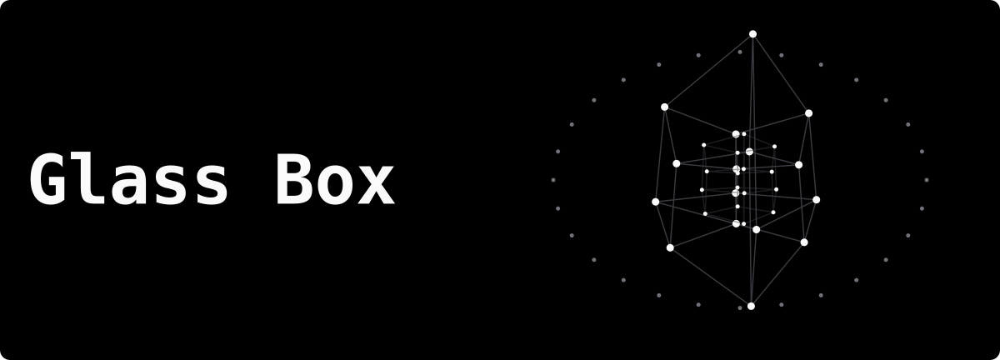</a>

Interactive simulations of how AI systems work, with the math behind each one
and the caveats on where toy models stop matching real ones.
[Try it in your browser.](https://gmdkaio.github.io/glass-box/) In English and Brazilian Portuguese.

## Modules

Each module is one simulation. Click a picture to open it.

<!-- modules:start -->
<table>
<tr>
<td width="50%" valign="top">
<a href="https://gmdkaio.github.io/glass-box/how-it-works"></a><br>
<b><a href="https://gmdkaio.github.io/glass-box/how-it-works">How it works</a></b><br>
<sub>Using AI · 1 of 8</sub><br>
A tiny network reads one word and gives odds for the next, one word at a time.
</td>
<td width="50%" valign="top">
<a href="https://gmdkaio.github.io/glass-box/sampling"></a><br>
<b><a href="https://gmdkaio.github.io/glass-box/sampling">Why answers vary</a></b><br>
<sub>Using AI · 2 of 8</sub><br>
The model picks each word like weighted dice, so the same question gets different answers.
</td>
</tr>
<tr>
<td width="50%" valign="top">
<a href="https://gmdkaio.github.io/glass-box/compounding">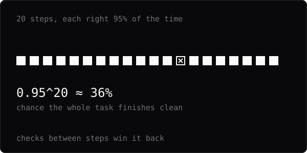</a><br>
<b><a href="https://gmdkaio.github.io/glass-box/compounding">Long tasks</a></b><br>
<sub>Using AI · 3 of 8</sub><br>
Small chances of a slip multiply over many steps, and checks between steps win them back.
</td>
<td width="50%" valign="top">
<a href="https://gmdkaio.github.io/glass-box/context"></a><br>
<b><a href="https://gmdkaio.github.io/glass-box/context">Context</a></b><br>
<sub>Using AI · 4 of 8</sub><br>
The more text you paste, the smaller the share of attention the answer gets.
</td>
</tr>
<tr>
<td width="50%" valign="top">
<a href="https://gmdkaio.github.io/glass-box/tokenization"></a><br>
<b><a href="https://gmdkaio.github.io/glass-box/tokenization">Tokenization</a></b><br>
<sub>Using AI · 5 of 8</sub><br>
The model reads text as numbered chunks, so the letters inside them are hidden from it.
</td>
<td width="50%" valign="top">
<a href="https://gmdkaio.github.io/glass-box/calibration"></a><br>
<b><a href="https://gmdkaio.github.io/glass-box/calibration">Calibration</a></b><br>
<sub>Using AI · 6 of 8</sub><br>
How sure a model sounds, compared with how often it is right.
</td>
</tr>
<tr>
<td width="50%" valign="top">
<a href="https://gmdkaio.github.io/glass-box/agreement">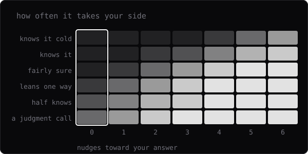</a><br>
<b><a href="https://gmdkaio.github.io/glass-box/agreement">What you want to hear</a></b><br>
<sub>Using AI · 7 of 8</sub><br>
Chat models lean toward agreeing with you, and your opinions and settings tilt the answer most where the model is unsure.
</td>
<td width="50%" valign="top">
<a href="https://gmdkaio.github.io/glass-box/retrieval"></a><br>
<b><a href="https://gmdkaio.github.io/glass-box/retrieval">Retrieval</a></b><br>
<sub>Using AI · 8 of 8</sub><br>
Before the model answers from documents, a search picks the few pages it gets to read.
</td>
</tr>
<tr>
<td width="50%" valign="top">
<a href="https://gmdkaio.github.io/glass-box/quantization"></a><br>
<b><a href="https://gmdkaio.github.io/glass-box/quantization">Shrinking a model</a></b><br>
<sub>Under the hood · 1 of 8 · Local models</sub><br>
Rounding every number in a model to fewer values saves memory and costs accuracy.
</td>
<td width="50%" valign="top">
<a href="https://gmdkaio.github.io/glass-box/memory"></a><br>
<b><a href="https://gmdkaio.github.io/glass-box/memory">Fitting in memory</a></b><br>
<sub>Under the hood · 2 of 8 · Local models</sub><br>
A model needs memory for its numbers and for a cache that grows with every token of the chat.
</td>
</tr>
<tr>
<td width="50%" valign="top">
<a href="https://gmdkaio.github.io/glass-box/embeddings"></a><br>
<b><a href="https://gmdkaio.github.io/glass-box/embeddings">Embeddings</a></b><br>
<sub>Under the hood · 3 of 8</sub><br>
Words used in similar places get similar numbers, which is how search by meaning works.
</td>
<td width="50%" valign="top">
<a href="https://gmdkaio.github.io/glass-box/sampling-settings"></a><br>
<b><a href="https://gmdkaio.github.io/glass-box/sampling-settings">Sampling settings</a></b><br>
<sub>Under the hood · 4 of 8 · Local models</sub><br>
Before each pick, top-k, top-p and min-p drop unlikely words, and a repeat penalty lowers words already used.
</td>
</tr>
<tr>
<td width="50%" valign="top">
<a href="https://gmdkaio.github.io/glass-box/lora"></a><br>
<b><a href="https://gmdkaio.github.io/glass-box/lora">LoRA</a></b><br>
<sub>Under the hood · 5 of 8 · Fine-tuning</sub><br>
LoRA trains a thin patch beside a frozen model, and a low rank is enough for most changes.
</td>
<td width="50%" valign="top">
<a href="https://gmdkaio.github.io/glass-box/learning-rate"></a><br>
<b><a href="https://gmdkaio.github.io/glass-box/learning-rate">Learning rate</a></b><br>
<sub>Under the hood · 6 of 8 · Fine-tuning</sub><br>
The learning rate sets how big each training step is: too small barely learns, too big overshoots.
</td>
</tr>
<tr>
<td width="50%" valign="top">
<a href="https://gmdkaio.github.io/glass-box/overfitting"></a><br>
<b><a href="https://gmdkaio.github.io/glass-box/overfitting">Overfitting</a></b><br>
<sub>Under the hood · 7 of 8 · Fine-tuning</sub><br>
Trained too long on too little text, a model learns it by heart and gets worse at everything else.
</td>
<td width="50%" valign="top">
<a href="https://gmdkaio.github.io/glass-box/evaluation"></a><br>
<b><a href="https://gmdkaio.github.io/glass-box/evaluation">Evaluating a model</a></b><br>
<sub>Under the hood · 8 of 8</sub><br>
When test questions leak into training, a model scores well on the test and no better on new questions.
</td>
</tr>
</table>
<!-- modules:end -->

## Engine

Pure C, no dependencies beyond the standard library. All math lives here; the
web UI only displays what the engine computes.

## Run it locally

You need Node 22. The compiled engine is already in the repo, so this is enough
to run the site:

```sh
cd web
npm ci
npm run dev
```

To change the engine you also need a C compiler. Test it natively, then rebuild
the wasm with [Emscripten](https://emscripten.org) (run `emsdk_env.sh` or `emsdk_env.ps1` first):

```sh
cd engine
make test        # native tests
make wasm-test   # builds the wasm and checks it gives the same numbers
make wasm-web    # copies the build into web/src/lib/wasm
```

`npm run build` in `web/` writes the static site to `web/build`. The module pictures
in this README come from `node scripts/readme-modules.mjs` in `web/`.

## Licence

[MIT](LICENSE). The site uses the [JetBrains Mono](https://www.jetbrains.com/lp/mono/)
font, under the SIL Open Font License 1.1.
